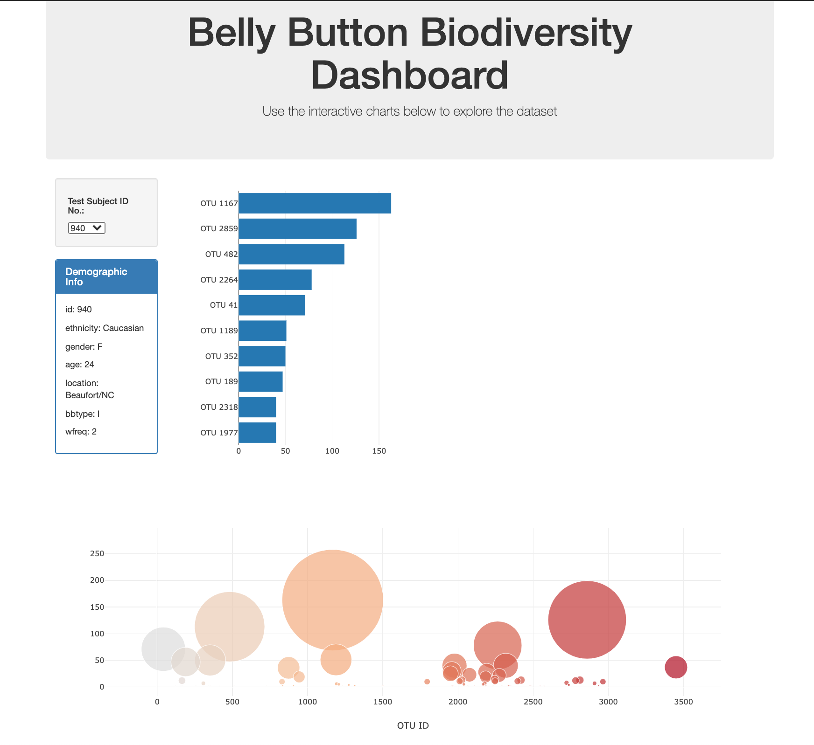

# Belly Button Biodiversity Dashboard

## Introduction
Build an interactive dashboard to explore the [Belly Button Biodiversity dataset](http://robdunnlab.com/projects/belly-button-biodiversity/), which catalogs the microbes that colonize human navels.

## Data
* [Belly Button Biodiversity dataset](samples.json)

## Plotly
1. Use the D3 library to read in `samples.json`

2. Create a horizontal bar chart with a dropdown menu to display the top 10 OTUs found in that individual
  * Use `sample_values` as the values for the bar chart.
  * Use `otu_ids` as the labels for the bar chart.
  * Use `otu_labels` as the hovertext for the chart.

3. Create a bubble chart that displays each sample.
  * Use `otu_ids` for the x values.
  * Use `sample_values` for the y values.
  * Use `sample_values` for the marker size.
  * Use `otu_ids` for the marker colors.
  * Use `otu_labels` for the text values.

4. Display the sample metadata, i.e., an individual's demographic information

5. Update all of the plots any time that a new sample is selected.

## Copyright

Trilogy Education Services © 2021. All Rights Reserved.
